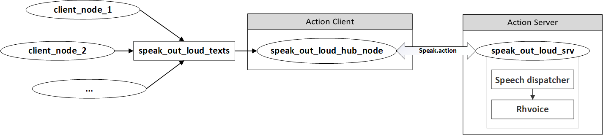
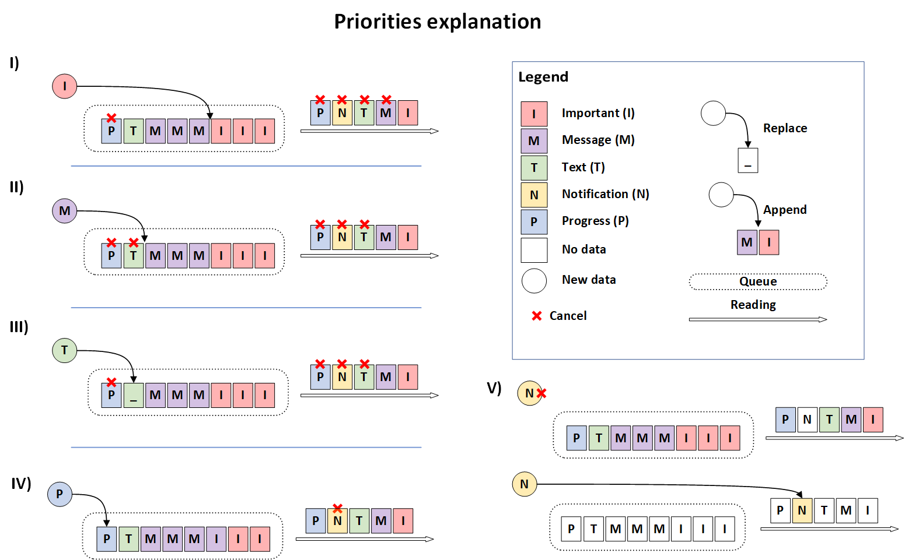

# Speak out loud
*Speak out text from topic*

<p align="center">

<!-- <add logo> -->

<a href="LICENSE"></a>
<a></a>
<a></a>
</p>

*README is available on languages: [English](README.md), [Russian](README.ru.md)*

*[TESTING scenarios](TESTS.md)*

## Cite

### Repository
```bibtex
@misc{speak_out_loud,
 author = {Malyshev, Alexander},
 booktitle = {GitHub repository},
 publisher = {GitHub},
 title = {{Speak out loud}},
 url = {https://github.com/asanmalyshev/speak_out_loud},
 year = {2020}
}
```

## Description
speak_out_loud - ROS package to generate speech from text, that supports russian language.

Package is based on voice generator RHVoice and high level audio interface for speech synthesis Speech Dispatcher.

To say text just send it packed into message of SpeakGoal type in topic *sol/texts*.

Advanced speech control includes:
* priorities, which allows to proiritize one messages over anothers;
* whitelist to allow only a few nodes to speak;
* blacklist to block messages from some nodes;
* debug mode to provide extra information (if reqired).

Author:  Alexander Malyshev <asanmalyshev AT gmail DOT com>               
Youtube video with some examples (in Russian): https://youtu.be/uVPauu7p71E

## Dependencies
Package depends on [RHVoice](https://github.com/Olga-Yakovleva/RHVoice/) and [Speech Dispatcher (spd)](https://github.com/brailcom/speechd).
Look for full installation guide and troubleshooting on official sites.
Short installation is below.


## Short installation guides for Ubuntu
Package tested on Ubuntu 18.04 (ROS Melodic) and Ubuntu 20.04 (ROS Noetic)

### Rhvoice
```shell
sudo add-apt-repository ppa:linvinus/rhvoice
sudo apt-get update
sudo apt-get install rhvoice rhvoice-english rhvoice-russian 
```
Add another language installing package rhvoice-*language_name*. See all available ones using tab completion.

### Speech dispatcher
```shell
sudo apt install speech-dispatcher speech-dispatcher-rhvoice speech-dispatcher-audio-plugins libspeechd-dev python3-speechd
```

### Package speak_out_loud
- clone repo in your catkin workspace: 
```shell
cd ~/catkin_ws/src #change [catkin_ws] on your own ws name
git clone https://github.com/asanmalyshev/speak_out_loud
```
- build package with `catin_make` or `catkin_tools`:
```shell
catkin_make 
```
or 
```shell
catkin build speak_out_loud
```

## Launching
```shell
roslaunch speak_out_loud speak_out_loud.launch
```
Some parameters are available to configure launch.

### Parameters
| Param | Description | Values | Default 
| --- | --- | --- | ---
| ___output___ | direct logs output | screen/log | screen 
| ___default_voice___ | default voice | some voices: elena/aleksndr | elena 
| ___whitelist___ | whitelist of nodes to be spoken | list of values | [ ] 
| ___blacklist___ | blacklist of nodes not to be spoken | list of values | [ ] 
| ___debug___ | use debug mode | True/False | False
| ___use_action_interface___ | use action interface | True/False | False 

Full list of available voices might be found [here](https://github.com/RHVoice/RHVoice/wiki/Latest-version).

Russian voices work well with english too. 
Using them also let you mixing russian and english words.

Users may define whitelist/blacklist of nodes to work with.
See more in [section](#tuning-nodes-to-be-spoken).

### Sound trouble
Sometimes glitches, skips or crackling appears. 
To get rid of them, some changes in pulseaudio setup must be done.

Edit file `/etc/pulse/default.pa/`:
find a line `load-module module-udev-detect` and replace it with `load-module module-udev-detect tsched=0`.
Reboot your system. There must be no flickering.

### Speech is cutted
Speech dispatcher by default is configured to shut ifself down after sometime if no clients are connected. 
As speak_out_loud server after sending a text disconnects from speech dispatcher, it is possible some texts will be cutted.
To avoid that edit file `/etc/speech-dispatcher/speechd.conf`:
find Parameter `Timeout`, uncomment it and change a number of seconds it must wait after disconnection of the last client or setup it =0 to let server exist as long as it can.

## Testing
There're two ways to test the package: 
- with bash command;
- launching example node.

### Bash way
```shell
rostopic pub /sol/texts speak_out_loud/SpeakGoal "{sender_node: '', text: 'Привет', voice: '', priority: 1, debug: false}"
```

### Example node way
```shell
roslaunch speak_out_loud speak_out_loud_client_example.launch 
```
Type some words to say and type priority. 
#### Client emulator launch parameters
| Param | Description | Values | Default 
| --- | --- | --- | ---
| ___output___ | direct logs output | screen/log | screen 
| ___node_name___ | name of node |  | speak_out_loud_client

<!-- | ___debug___ | publish texts in debug topic | True/False | False -->


## Nodes
___/sol/sol_server____

Speak out loud server. It gets texts with priorities and works them out.

## Topics
___Published topics___
| Topic | Type | Description 
| --- | --- | --- 
___sol/do_i_say___ | ([std_msgs/Bool](http://docs.ros.org/en/api/std_msgs/html/msg/Bool.html)) | send True if something is going to be said, False if server ends speech

___Subscribed topics___
| Topic | Type | Description 
| --- | --- | --- 
___sol/texts___ | ([speak_out_loud/SpeakGoal](action/Speak.action)) | topic for messages to sound 
___/sol/action_iface/goal___ | ([speak_out_loud/SpeakGoal](action/Speak.action)) | if action interface is on: goal topic 
___/sol/action_iface/cancel___ | ([actionlib_msgs/GoalID](http://docs.ros.org/en/api/actionlib_msgs/html/msg/GoalID.html)) | if action interface is on: cancelation topic
___/sol/action_iface/feedback___ | ([speak_out_loud/SpeakFeedback](action/Speak.action)) | if action interface is on: feedback topic
___/sol/action_iface/result___ | ([speak_out_loud/SpeakResult](action/Speak.action)) | if action interface is on: result topic
___/sol/action_iface/status___ | ([actionlib_msgs/GoalStatusArray](http://docs.ros.org/en/api/actionlib_msgs/html/msg/GoalStatusArray.html)) | if action interface is on: status topic


## Client-server interface
Clients communicate with server over [action/Speak.action](action/Speak.action).
```
# goal
string  sender_node   # sender node name 
string  text          # text to read
string  voice          # voice to speak with
uint8    priority     # priority of text
---
# result
uint8 success         # result of reading text (not used in current version) 
---
# feedback
string message        # feedback of operation (not used in current version)
```
Goal section is filled in user node which sends data.
- ___text___ contains text to be spoken __*)__;
- ___voice___ voice to speak with. If not set, the default voice is used;
- ___priority___ is a number [1,5]. For convenience these values are associated with constants in [msg/Priority.msg](msg/Priority.msg). Prioritization rules are explaned in [Messages priorities](#messages-priorities) section. Default value: Priority.TEXT;
- ___sender_node___ contains node names data came from. This value is filled manually.
It shouldn't be empty if you use whitelist/blacklist. By default it is empty. 
> ___*)___ - values are required

## Messages priorities
In real systems there's a change messages on sound server come from many nodes.



To organize queue of messages priorities might be used.
In speech dispatcher, there're 5 types of priorities,
which are repeated in [msg/Priority.msg](msg/Priority.msg). 
| Priority | Value 
| --- | :---: 
 IMPORTANT | 1 |
 MESSAGE | 2 |
 TEXT | 3 |
 NOTIFICATION | 4 |
 PROGRESS | 5 |

In Priorty.msg values MIN=0 and MAX=6 are added for convenience in defining values scope limits.

Read more about priorites in [spd documentation / communication protocol (SSIP) description](https://htmlpreview.github.io/?https://github.com/brailcom/speechd/blob/master/doc/ssip.html#Message-Priority-Commands).

On image below there's an infographic of how different priorities work:


First of all, there is a queue Q of texts and a current reading text (CRT).
Queue consists of fields, all of which have priorities.
There might be many texts of IMPORTANT and MESSAGE type (they form subqueues in Q), but there's only one text of each TEXT and PROGRESS type and none of NOTIFICATION.

Three operations with new messages in Q take place: cancelation, append and replace.
New IMPORTANT and MESSAGE are appended at the end of subqueue,
meanwhile other types replace stored values.

At any moment both Q and CRT might be:
- filled/partially filled with text (colored boxes) - there're texts in Q that must be read / there's a text that is being read now;
- empty (white boxes) - there's nothing to read and nothing is reading. 

In following cases "text" means text value of income message.

1) When new IMPORTANT comes:
- everything except IMPORTANT that is reading is canceled;
- if CRT is empty, text is send as CRT, otherwise it joins the IMPORTANT subqueue;
- PROGRESS in Q is canceled.

2) When new MESSAGE comes:
- everything except IMPORTANT and MESSAGE that is reading is canceled;
- if CRT is empty, text is send as CRT, otherwise it joins the MESSAGE subqueue;
- TEXT and PROGRESS in Q are canceled.

3) When new TEXT comes:
- if PROGRESS, NOTIFICATION or TEXT is CRT, it is canceled;
- if CRT is empty, text is send as CRT, otherwise it replaces TEXT value in Q;
- PROGRESS in Q is canceled.

4) When new NOTIFICATION comes:
- if Q is not empty, text is canceled;
- if there's another NOTIFICATION is CRT, it is canceled and a new NOTIFICATION is read.

5) When new PROGRESS comes:
- if NOTIFICATION is in CRT, it is canceled, text is read;
- if Q is not empty or not NOTIFICATION is in CRT, text replaces value in Q;
- if no more messages of this priority come, it is spoken with priority MESSAGE.


## Tuning nodes to be spoken

### Debug mode
For debuggin there's a special field debug in SpeakGoal message. When debug mode is off, all messages with True value of debug field are ignored. Texts with debug=True are proccessed only if launch parameter ___debug___=True.

###  Filtering
To narrow list of nodes down, whose texts should be read, whitelist and blacklist are used.
Whitelist has priority over blacklist. 
It means, if they are both defined, only whitelist is used.
By default, both lists are empty and server processes all messages.
Both lists are organized over ros services /sol/whitelist_control and /sol/blacklist_control of same [speak_out_loud/SpeakFilter](srv/SpeakFilter) type.
```
string name     # name to operate
bool operation  # operation
---
string[] nameslist   # current list
bool    status       # True - filtering is on, False - filtering is off
```
_Request_
| Field | Type | Description 
| --- | --- | --- 
___name___ | ([std_msgs/String](http://docs.ros.org/en/api/std_msgs/html/msg/String.html)) | name to operate
___operation___ | ([std_msgs/Bool](http://docs.ros.org/en/api/std_msgs/html/msg/Bool.html)) | True - add name in list, False - exclude from list 

_Response_
| Field | Type | Description 
| --- | --- | --- 
___nameslist___ | ([std_msgs/String](http://docs.ros.org/en/api/std_msgs/html/msg/String.html)[]) | current list
___status___ | ([std_msgs/Bool](http://docs.ros.org/en/api/std_msgs/html/msg/Bool.html)) | True - filtering is on, False - filtering is off

To turn on/off filtering by any list, user should send request with name='' and operation=True if filtering sould be on or operation=False if filtering sould be off.
Send not empty name to add (operation=True) or remove (operation=False) it from filtering list.

If __whitelist__ has elements, hub checks if incoming messages are from that list and __forward them on server, otherwise__ messages are __ignored__.
```xml
<!-- your awesome launch file -->
<launch>
  <!-- ... -->
  <include file="$(find speak_out_loud)/launch/speak_out_loud.launch">
    <arg name="whitelist" value="[/speak_out_loud_client]"/>
  </include>
  <!-- ... -->
</launch>
```
If __blacklist__ has elements, hub checks if incoming messages are from that list and __block them, otherwise__ forward them on __server__.
```xml
<!-- your even more awesome launch file -->
<launch>
  <!-- ... -->
  <include file="$(find speak_out_loud)/launch/speak_out_loud.launch">
    <arg name="blacklist" value="[/speak_out_loud_client]"/>
  </include>
  <!-- ... -->
</launch>
```
Once set whitelist/blacklist might be extended in real time with sending name of appending node in corresponding [topic](#Topics).
It automatically turns filtering with that list on.

Also whitelisting/blacklisting might be turned on/off with sending True/False value in corresponding [topic](#Topics).
When turning on one list, another is automatically disabled. Turning lists off do not delete their content.


## Priorities assignment

In general the most preferable priorities are MESSAGE and TEXT. Which one to use depends on a soundsystem workload.
For systems with seldom texts to read TEXT is enough (default priority). 
If texts come often and may overlay each other, MESSAGE is preferable.

Use IMPORTANT in ugrent situations leaving texts short. 
Some examples: loss of Internet connection, low battery, burning robot, loosing wheels, trucks, another usually not odd parts. 

As there's no guarantee NOTIFICATION would be said,
it has no special use in robotics except breaking night's sielence with random useless phrases scaring everyone around.

As PROGRESS messages have a complex behavior, sometimes influence on queue in non-intuitive way, it is better to avoid them. 
In testing section functionality of that type is shown on basic level, more advanced scenarios don't inlcude it. 


## Testing packages

Testing scenarios are stored in separate file *[TESTS.md](TESTS.md)*


## License

Package is distributed under GPLv2 or later licence.

RHVoice uses [LGPLv2.1](https://www.gnu.org/licenses/old-licenses/lgpl-2.1.html). 
But for compilation it uses MAGE which is under [GPLv3](https://www.gnu.org/licenses/gpl-3.0.html). 
For working under GPLv2 recompile library without MAGE.
See more information in licensing section on package site.

Speech dispatcher contains modules, applications, libraries which is under [LGPLv2.1](https://www.gnu.org/licenses/old-licenses/lgpl-2.1.html), [GPLv2](https://www.gnu.org/licenses/old-licenses/gpl-2.0.html) or GPLv2-or-later.
See more information in licensing section on package site.
